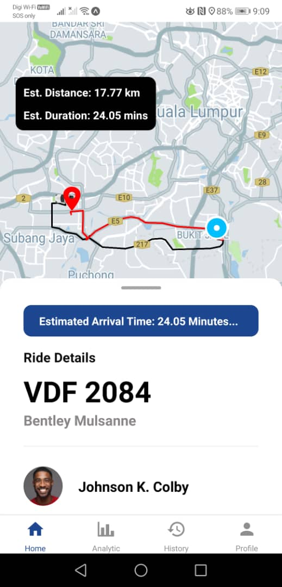

<h1 align="center">
 🏁 Corporate E-Chauffeur System (Chauffeseur) 🏁
</h1>
Final Year Project Year 3 Software Engineering (FYP)
 

## Supported Platforms 📱

  <table width="auto" align="center" >
  <tr>
<td> OS </td>
   <td> Status </td> 
   </tr>
    <tr>
<td> Android </td>
     <td align="center"> 
     Tested And Works Fine
     </td> 
   </tr>
    <tr>
<td> iOS </td>
   <td> Not yet tested </td> 
  </tr>
  </table >

## Target Users:

1. Passengers
2. Chauffeurs as Drivers
3. Corporates

## App Preview 👁️‍🗨️

  
  &nbsp;&nbsp;&nbsp;
  

## Passenger UI Screens:

  
  &nbsp;&nbsp;&nbsp;
  
  &nbsp;&nbsp;&nbsp;
  

 

  
  &nbsp;&nbsp;&nbsp;
  
  &nbsp;&nbsp;&nbsp;
  

 

  
  &nbsp;&nbsp;&nbsp;
  
  &nbsp;&nbsp;&nbsp;
  

  
  &nbsp;&nbsp;&nbsp;
  

